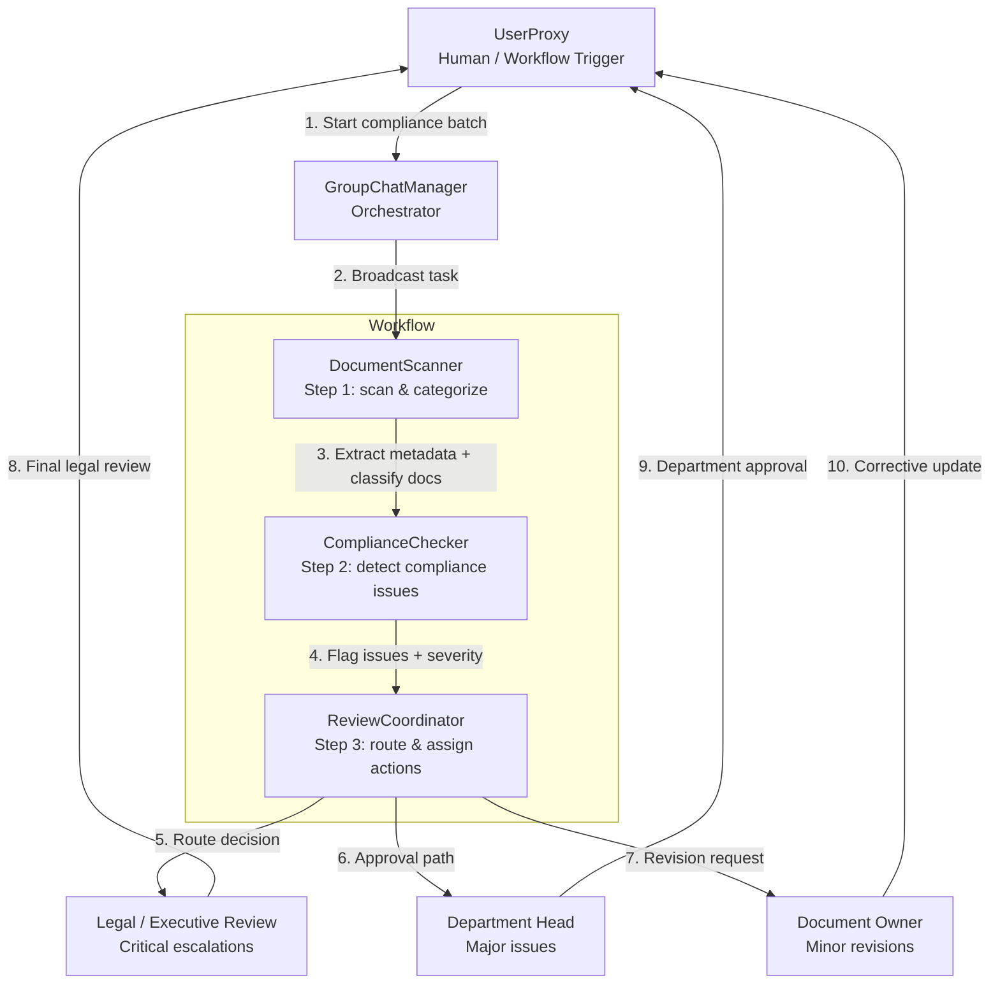

# AutoGen Agent Topology

This topology reflects the orchestration implemented in [code.py](code.py): a `GroupChat` with a `GroupChatManager` and four cooperating agents.

## Orchestration flow

1. `UserProxy` starts a batch workflow with the sample documents.
2. `GroupChatManager` coordinates the conversation between agents.
3. `DocumentScanner` inspects each document, derives metadata, and identifies document type.
4. `ComplianceChecker` reviews for missing approvals, outdated references, or incomplete sections.
5. `ReviewCoordinator` assigns issue severity and decides routing.
6. `Legal/Executive`, department heads, or document owners handle the resolution path depending on the issue class.

## Labels used in the code

- `DocumentScanner` = document intake and categorization
- `ComplianceChecker` = issue detection and severity classification
- `ReviewCoordinator` = routing, remediation planning, and audit trail
- `UserProxy` = human-triggered workflow initiator
- `GroupChatManager` = orchestration engine for the multi-agent runtime
